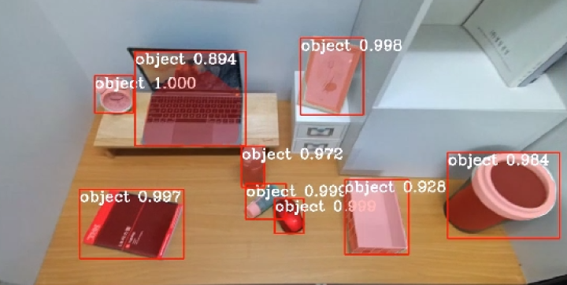

# The ROS Package of Mask R-CNN for Object Detection and Segmentation

This is a ROS package of [Mask R-CNN](https://arxiv.org/abs/1703.06870) algorithm for object detection and segmentation.

The package contains ROS node of Mask R-CNN with topic-based ROS interface.

Most of core algorithm code was based on [Mask R-CNN implementation by Matterport, Inc. ](https://github.com/matterport/Mask_RCNN)

This is for Object detection which can detect several objects regardless of their classes.

But it can not classify their classes. It just detects objects.

## Training

This repository doesn't contain code for training Mask R-CNN network model.
If you want to train the model on your own class definition or dataset, try it on [the upstream reposity](https://github.com/matterport/Mask_RCNN) and give the result weight to `model_path` parameter.

## Requirements
* ROS kinetic/Melodic
* TensorFlow 1.14
* Keras 2.1.13
* Numpy, skimage, scipy, Pillow, cython, h5py
* I only test code on Python3.X.

## ROS Interfaces
 
### Parameters

* `~model_path: string`

    Path to the HDF5 model file.
    If the model_path is default value and the file doesn't exist, the node automatically downloads the file.

    Default: `$ROS_HOME/mask_rcnn_coco.h5`

* `~visualization: bool`

    If true, the node publish visualized images to `~visualization` topic.
    Default: `true`

* `~class_names: string[]`

    Class names to be treated as detection targets.
    Default: All MS COCO classes.

### Topics Published

* `~result: mask_rcnn_ros/Result`

    Result of detection. See also `Result.msg` for detailed description.

* `~visualization: sensor_mgs/Image`

    Visualized result over an input image.

### Topics Subscribed

* `~input: sensor_msgs/Image`

    Input image to be proccessed

## Getting Started

1. Clone this repository to your catkin workspace, build workspace and source devel environment 
2. Download the [trained model](https://koreaoffice-my.sharepoint.com/:u:/g/personal/jhj0630_korea_edu/EUOUPnsE1tVEp_mstw8ZFI8BrbYidzhQr8RltE67Bp4I6w?e=rNsTW8) and locate it at proper path.
3. Run mask_rcnn node
      ~~~bash
      $ rosrun mask_rcnn_ros mask_rcnn_node
      ~~~

## Example

There is a simple example launch file using [RGB-D SLAM Dataset](https://vision.in.tum.de/data/datasets/rgbd-dataset/download).

~~~bash
$ sudo chmod 777 scripts/download_freiburg3_rgbd_example_bag.sh
$ ./scripts/download_freiburg3_rgbd_example_bag.sh
$ roslaunch mask_rcnn_ros freiburg3_rgbd_example.launch
~~~

